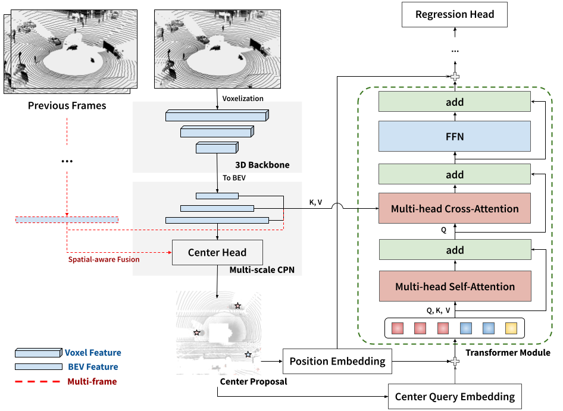

# CenterFormer
Implementation for CenterFormer: Center-based Transformer for 3D Object Detection (ECCV 2022)

Code is coming soon!

<p align="center">  </p>

## Abstract
Query-based transformer has shown great potential in constructing long-range attention in many image-domain tasks, but has rarely been considered in LiDAR-based 3D object detection due to the overwhelming size of the point cloud data. In this paper, we propose **CenterFormer**, a center-based transformer network for 3D object detection. CenterFormer first uses a center heatmap to select center candidates on top of a standard voxel-based point cloud encoder. It then uses the feature of the center candidate as the query embedding in the transformer. To further aggregate features from multiple frames, we design an approach to fuse features through cross-attention. Lastly, regression heads are added to predict the bounding box on the output center feature representation. Our design reduces the convergence difficulty and computational complexity of the transformer structure. The results show significant improvements over the strong baseline of anchor-free object detection networks. CenterFormer achieves state-of-the-art performance for a single model on the Waymo Open Dataset, with 73.7% mAPH on the validation set and 75.6% mAPH on the test set, significantly outperforming all previously published CNN and transformer-based methods.

[arXiv](https://arxiv.org/abs/2209.05588)

## Citation
```
@InProceedings{Zhou_centerformer,
title = {CenterFormer: Center-based Transformer for 3D Object Detection},
author = {Zhou, Zixiang and Zhao, Xiangchen and Wang, Yu and Wang, Panqu and Foroosh, Hassan},
booktitle = {ECCV},
year = {2022}
}
```
